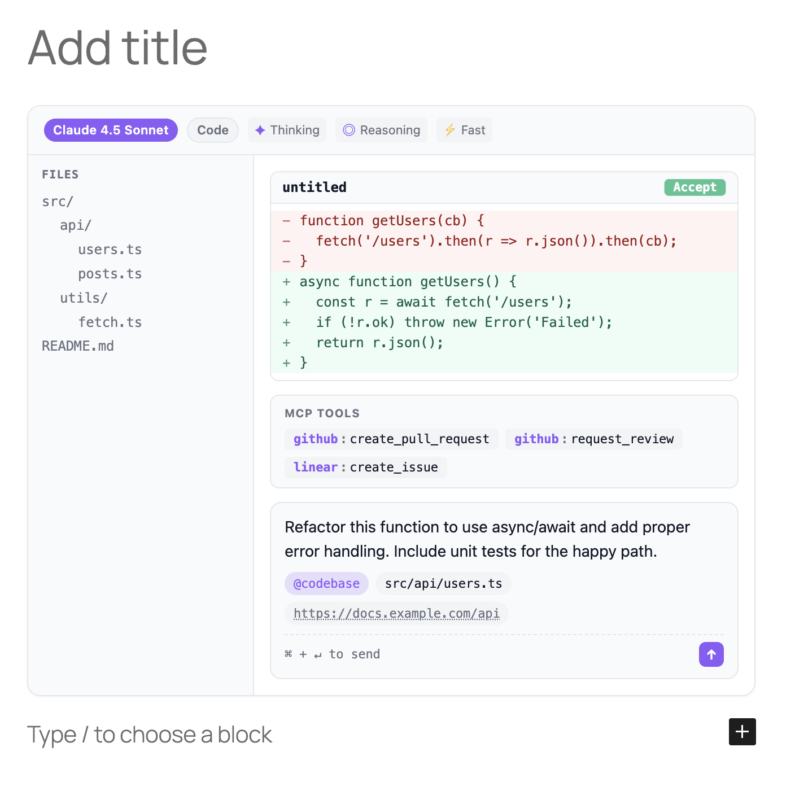
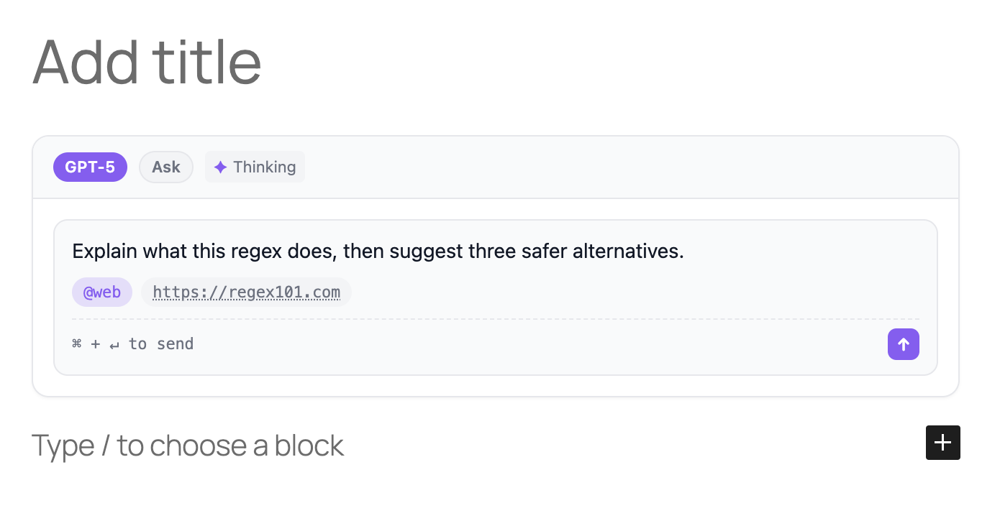

# AI Prompt — A Gutenberg block for showing AI prompts properly

[](https://github.com/f/ai-prompt/releases)
[](https://www.gnu.org/licenses/old-licenses/gpl-2.0.html)
[](https://github.com/f/ai-prompt/actions/workflows/ci.yml)
[](https://playground.wordpress.net/?blueprint-url=https://raw.githubusercontent.com/f/ai-prompt/main/blueprint.json)

A native WordPress block that displays AI prompts the way they're meant to be seen — with the model, mode, context chips, and composer UI your readers already recognize from their AI tools.

No iframe. No third-party service required. Just clean, themed HTML with a tiny frontend script only for copying prompts to the clipboard.

[Try the live demo in WordPress Playground](https://playground.wordpress.net/?blueprint-url=https://raw.githubusercontent.com/f/ai-prompt/main/blueprint.json).



## The problem this solves

If you write tutorials, documentation, or blog posts about AI, you eventually need to show a prompt. Today, the options are bad:

- **Code blocks** turn the prompt into something that looks like code, when it isn't. They strip the context (which model? what mode? was thinking on?). They invite copy-and-execute confusion.
- **Blockquotes** look like quoted prose. They lose the "this is meant for an AI" framing entirely.
- **Screenshots** go stale the moment Cursor or Claude refresh their UI. They're not crawlable, not copyable, not accessible.
- **Iframes** are the closest thing today, but they pull in a third-party origin, can't match your theme, often break on RSS / AMP / email clients, and break entirely if the host goes down.

**Prompts deserve a first-class block.** Same as code blocks earned one. Same as embed blocks did. This is that block for prompts.

## Use cases

- **Tutorial posts** — "How to refactor a function with Claude": show the literal prompt, model badge, thinking mode, the files in context. Your reader sees exactly what you'd type.
- **Prompt-engineering write-ups** — compare three variants of a prompt side-by-side, each with its own model and indicators. Visible at a glance.
- **Product documentation** — if your SaaS ships AI features, show example prompts your users can paste in. Branded with your colors via Light/Dark accents.
- **AI tool walkthroughs** — Cursor, Claude Code, ChatGPT, Codex tutorials where the prompt + mode + file tree + diff are part of the story. This block ships all of them.
- **Course material** — embed prompts inline in lessons without the visual whiplash of switching between prose and code blocks.
- **Case studies** — "We shipped this with one prompt": show MCP tools, diff, accept/reject. Engineering blog posts that read like the real workflow.
- **Release notes** — when your AI product adds a feature, demonstrate it with a real prompt embed instead of a screenshot.

## What it looks like

The hero above shows the block at its richest — model badge, indicators, a parsed file tree, a unified diff with an Accept button, MCP tools, and the prompt with context chips.

But most of the time you'll reach for something far simpler — just a prompt with a couple of context items:



Both come from the same block. What changes is configuration, not code.

The full feature surface:

- A model badge (`GPT-5.5`, `Claude Sonnet 4.8`, or any custom model name)
- A mode badge (`Chat` / `Code` / `Ask` / `Plan`)
- Indicator chips: Thinking, Reasoning, Planning, Fast, Max
- The prompt itself, preserving whitespace
- Context chips classified by prefix: `@web` → mention, `#image` → image, `https://…` → URL, `file.ts` → file
- An optional parsed file tree sidebar, built from slash-separated paths
- An optional diff view with a pulsing Accept/Reject button
- An optional MCP tools row
- An optional single Run button with a small dropdown of relevant tools (ChatGPT, Claude, Cursor, GitHub Copilot, v0, Bolt, Perplexity)
- A Copy button that is always visible and copies the prompt text to the clipboard
- A composer footer with a send-key hint

All of it themed by `prefers-color-scheme` or forced to light/dark, with per-mode accent colors.

## Why not just an iframe?

| Concern | Iframe embed | AI Prompt block |
|---|---|---|
| Page weight | Loads a full external app | A few KB of CSS plus a tiny clipboard helper |
| Theme fidelity | Fixed to the embed origin's design | Inherits your site, plus per-block accent colors |
| SEO / crawlability | Prompt text is hidden from crawlers | Real HTML in `post_content`; Google reads it |
| RSS, AMP, email | Often stripped or broken | Plain HTML survives anywhere |
| Privacy | Third-party request per page view | Zero external requests |
| Longevity | Breaks if the embed host goes down | Self-contained in your database |
| Accessibility | At the mercy of the host | Real semantic elements you can audit |

## Quick start

### Install from a release (recommended)

1. Download the latest `ai-prompt.zip` from the [Releases page](https://github.com/f/ai-prompt/releases).
2. In WordPress admin: **Plugins → Add New → Upload Plugin**, pick the zip, activate.
3. In any post or page, open the inserter and search for **AI Prompt**.

### Install from source

```bash
git clone https://github.com/f/ai-prompt.git wp-content/plugins/ai-prompt
cd wp-content/plugins/ai-prompt
npm ci
npm run build
```

### Auto-updates from GitHub

The plugin headers (`Update URI`, `GitHub Plugin URI`, `Primary Branch`) are compatible with the [Git Updater](https://git-updater.com/) plugin. Install Git Updater once, and your sites will pick up each tagged release here automatically.

## Using the block

In the block editor, type `/ai prompt` or open the inserter and search for "AI Prompt". The right sidebar exposes six panels:

| Panel | Controls |
|---|---|
| Prompt | The prompt text. A comma-separated list of context items. |
| AI Settings | Model, custom model name, mode (Chat / Code / Ask / Plan), and indicator toggles (Thinking, Reasoning, Planning, Fast, Max). |
| Run Dropdown | Toggle the single Run button and optionally provide custom `Label | URL` targets with `{prompt}` interpolation. |
| File Tree | Toggleable left rail. One path per line; indent with spaces to nest. |
| Diff View | Filename, old / new code, and a pulsing Accept / Reject button. |
| MCP Tools | Lines like `github:create_issue`, one per line. Server and tool are styled separately. |
| Appearance | Theme mode (`auto` / `light` / `dark`), page-font inheritance, and Light + Dark accent colors. |

The Run dropdown is generated from the block mode:

- `Code` shows code-oriented targets like Cursor, GitHub Copilot, v0, and Bolt.
- `Chat` / `Ask` show assistant and search targets like ChatGPT, Claude, and Perplexity.
- `Plan` shows planning-oriented targets like ChatGPT, Claude, and Manus.

These dropdown items are plain links. The block does not execute commands. To override the defaults, add one target per line in the Run Dropdown panel:

```text
Cursor | cursor://anysphere.cursor-deeplink/prompt?text={prompt}
Claude | https://claude.ai/new?q={prompt}
```

Block toolbar gives you `Wide` / `Full` alignment. The Styles tab gives you margin spacing.

### Context syntax

Whatever you type in the Context field is split on commas and classified per item:

| Prefix | Treated as |
|---|---|
| `@thing` | Mention chip (accent-colored) |
| `#thing` | Image chip (pink) |
| `https://…` | URL chip (subtle, underlined) |
| anything else | File chip |

So `@web, src/index.ts, #screenshot, https://example.com/spec` becomes four chips of four different kinds.

## Block API

The block registers as `fka/ai-prompt`. In `post_content`, an instance serializes as:

```html
<!-- wp:fka/ai-prompt {"prompt":"Refactor this function to use async/await.","mode":"chat","model":"Claude 4.5 Sonnet","thinking":true,"themeMode":"auto","lightColor":"#3b82f6","darkColor":"#60a5fa"} -->
<div class="wp-block-fka-ai-prompt ai-prompt-wrapper">
  ...
</div>
<!-- /wp:fka/ai-prompt -->
```

All attributes are stored in the block comment delimiter — none are HTML-sourced — so the block is robust against content edits, and migration to a dynamic renderer later is trivial.

## Development

```bash
npm ci
npm run start         # watch + rebuild on save
npm run build         # one-shot production build
npm run plugin-zip    # build a release-ready zip in the repo root
npm run lint:js
npm run lint:css
npm run format
```

### Testing in WordPress Playground (zero install)

```bash
npx @wp-playground/cli server \
  --mount=$(pwd):/wordpress/wp-content/plugins/ai-prompt \
  --login=true
```

Open <http://127.0.0.1:9400/wp-admin/post-new.php>, search for "AI Prompt", insert.

## Releasing

Releases are automated. Push a tag matching `v*` and the [release workflow](.github/workflows/release.yml) will:

1. `npm ci`
2. `npm run build`
3. `npm run plugin-zip` to produce `ai-prompt.zip`
4. Create a GitHub Release with auto-generated notes and the zip attached

To cut a release:

```bash
# 1. Bump the version in: package.json, ai-prompt.php, readme.txt, block.json
# 2. Update CHANGELOG.md
git commit -am "Release v0.2.0"
git tag v0.2.0
git push origin main --tags
```

Sites using Git Updater will pick up the new release within their update interval.

## Roadmap

- Block variations (one-click presets per AI tool)
- Block patterns (prompt + heading + result as a unit)
- A "Copy prompt" button on the frontend (opt-in)
- Block bindings — render a prompt from a custom field
- WP.org Plugin Directory submission

## License

[GPL-2.0-or-later](LICENSE). Contributions welcome — open an issue or PR.
